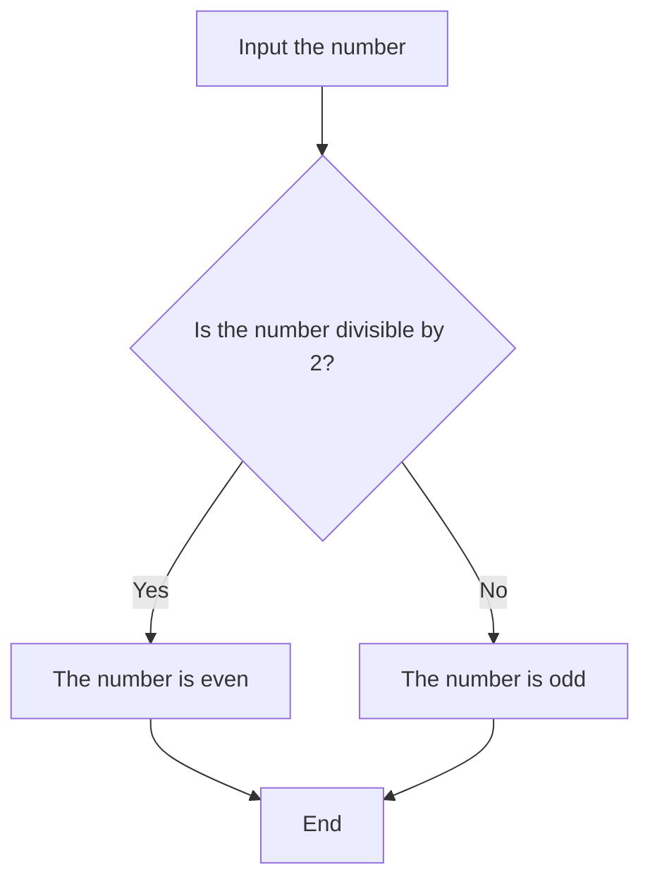

# core-code-from-scratch-readme

<h1>Algorithms - Week 1</h1>

<h2>Week challenges (Wednesday) 💻</h2>
<h3>Let's make pizza 🍕</h3>
<pre>
  <code>
&lt;pizza&gt;
  &lt;1 step="Making the Pizza Dough"&gt;
    &lt;1.1&gt;Proof the yeast&lt;/1.1&gt;
    &lt;1.2&gt;Make and knead the pizza dough&lt;/1.2&gt;
    &lt;1.3&gt;Let the dough rise&lt;/1.3&gt;       
  &lt;/1&gt;
  &lt;2 step="Preparing the Pizzas"&gt;
    &lt;2.1&gt;Preheat the pizza stone (or pizza pan or baking sheet)&lt;/2.1&gt;
    &lt;2.2&gt;Divide the dough into 2 balls&lt;/2.2&gt;
    &lt;2.3&gt;Prep the toppings&lt;/2.3&gt;
    &lt;2.4&gt;Flatten the dough ball, and stretch out into a round&lt;/2.4&gt;
    &lt;2.5&gt;Brush the dough top with olive oil&lt;/2.5&gt;
    &lt;2.6&gt;Sprinkle the pizza peel with cornmeal, put flattened dough on top&lt;/2.6&gt;
    &lt;2.7&gt;Spread with tomato sauce and sprinkle with topping&lt;/2.7&gt;
    &lt;2.8&gt;Slide pizza into the oven&lt;/2.8&gt;
    &lt;2.9&gt;Bake&lt;/2.9&gt;
  &lt;/2&gt;
  &lt;3&gt;
    Remove the pizza from the oven and let it cool for a few minutes before slicing it into portions
  &lt;/3&gt;
&lt;/pizza&gt;
  </code>
</pre>

 

<h3>Hot N Cold 🤒 🧊 🔥</h3>
<pre>
  <code>
&lt;convertion for="Celsius to Fahrenheit"&gt;
  &lt;1&gt;
    Take the Celsius temperature input from the user      
  &lt;/1&gt;
  &lt;2&gt;
    Multiply the Celsius temperature by 1.8
  &lt;/2&gt;
  &lt;3&gt;
    Add 32 to the result obtained in step 2
  &lt;/3&gt;
  &lt;4&gt;
    The resulting value is the temperature in Fahrenheit
  &lt;/4&gt;
&lt;/convertion&gt;
&lt;convertion for="Fahrenheit to Celsius Conversion"&gt;
  &lt;1&gt;
    Take the Fahrenheit temperature input from the user     
  &lt;/1&gt;
  &lt;2&gt;
    Subtract 32 from the Fahrenheit temperature
  &lt;/2&gt;
  &lt;3&gt;
    Divide the result obtained in step 2 by 1.8
  &lt;/3&gt;
  &lt;4&gt;
    The resulting value is the temperature in Celsius
  &lt;/4&gt;
&lt;/convertion&gt;
  </code>
</pre>

 

<h3>Some geometry 📐</h3>
<pre>
  <code>
&lt;calculate to="calculate the volume of a pyramid"&gt;
  &lt;input value="Base length, Base width, and Height of the pyramid"&lt;
  &lt;output value="Volume of the pyramid"&lt;
  &lt;1&gt;
    Read the values of Base length, Base width, and Height of the pyramid    
  &lt;/1&gt;
  &lt;2&gt;
    Calculate the area of the base of the pyramid using the formula Base area = Base length × Base width
  &lt;/2&gt;
  &lt;3&gt;
    Calculate the volume of the pyramid using the formula Volume = 1/3 × Base area × Height
  &lt;/3&gt;
  &lt;4&gt;
    Display the calculated volume of the pyramid
  &lt;/4&gt;
&lt;/calculate&gt;
&lt;calculate to="volume of a cube"&gt;
  &lt;input value="Length of each side of the cube"&lt;
  &lt;output value="Volume of the cube"&lt;
  &lt;1&gt;
    Read the value of Length of each side of the cube     
  &lt;/1&gt;
  &lt;2 &gt;
    Calculate the volume of the cube using the formula Volume = Length × Width × Height = a³ (since all sides are equal)
  &lt;/2&gt;
  &lt;3&gt;
    Display the calculated volume of the cube
  &lt;/3&gt;
&lt;/calculate&gt;
&lt;calculate to="volume of a sphere"&gt;
  &lt;input value="Radius of the sphere"&lt;
  &lt;output value="Volume of the sphere"&lt;
  &lt;1&gt;
    Read the value of Radius of the sphere     
  &lt;/1&gt;
  &lt;2&gt;
    Calculate the volume of the sphere using the formula Volume = (4/3) × π × r³
  &lt;/2&gt;
  &lt;3&gt;
    Display the calculated volume of the sphere
  &lt;/3&gt;
&lt;/calculate&gt;
  </code>
</pre>

 

<h2>Week challenges (Thursday) 💻</h2>

<h3>Numbers 📈</h3>

1. Input the number
2. Check if the number is divisible by 2.
3. If the number is divisible by 2, then print "The number is even."
4. Otherwise, print "The number is odd."

<h3>How old are you 👴</h3>

1. Input date_birth in the fomat 'DD/MM/YYYY' as a object type Date.
2. Get the current_date as a object type Date.
3. Calculate the difference between the current year and the birth year.
4. If the current month is less than the birth month, subtract one from the difference.
5. If the current month is equal to the birth month and the current day is less than the birth day, subtract one from the difference.
6. Return the difference as the person's age.

<h5>example:</h5>
<pre>
  <code>
Date date_birth;
read date_birth; //input '03/04/2001'
Date current_date = DateNow(); //value = '02/04/2023'
Number age = current_date.Year - date_birth.Year; //2023 - 2001 = 22
if date_birth.Month > current_date.Month then
        //04            //04
    age = age - 1; //22 -1 = 21
else if date_birth.Month == current_date.Month then
    if date_birth.Day > current_date.Day then
        //03                //02
        age = age - 1;

write age; //result = 21
  </code>
</pre>

<h3>Find the treasure 👑</h3>

We are in a room with three chests. We know that at least one has a treasure in it. Each chest has a message, but all the messages are lies.

1. Left chest: The middle chest has a treasure
  * The chest B doesn't has a treasure in it.
  * The chests A and C can have treasures in them.
2. Middle chest: All these chests have treasures in them
  * Don't all these chests have treasures.
  * Max two chests can have treasures in them.
3. Right chest: Only one of these chests has treasures.
  * More that one can have treasures in them.
  * Two chest has treasures in them.

<b>Answer: the chest A and C has a treasure in it.</b>

