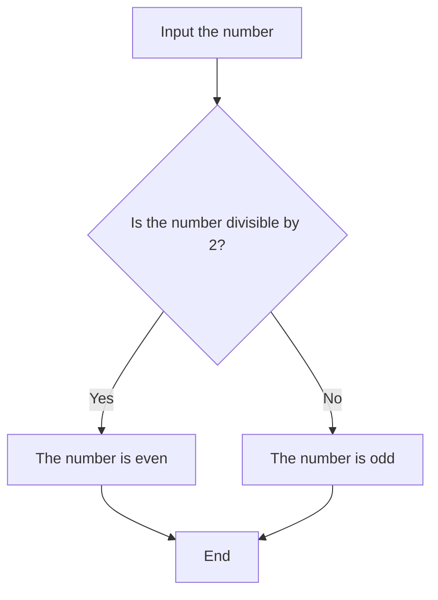

<h2>Week challenges (Thursday) 💻</h2>

<h3>Numbers 📈</h3>

1. Input the number
2. Check if the number is divisible by 2.
3. If the number is divisible by 2, then print "The number is even."
4. Otherwise, print "The number is odd."

<h3>How old are you 👴</h3>

1. Input date_birth in the fomat 'DD/MM/YYYY' as a object type Date.
2. Get the current_date as a object type Date.
3. Calculate the difference between the current year and the birth year.
4. If the current month is less than the birth month, subtract one from the difference.
5. If the current month is equal to the birth month and the current day is less than the birth day, subtract one from the difference.
6. Return the difference as the person's age.

<h5>example:</h5>
<pre>
  <code>
Date date_birth;
read date_birth; //input '03/04/2001'
Date current_date = DateNow(); //value = '02/04/2023'
Number age = current_date.Year - date_birth.Year; //2023 - 2001 = 22
if date_birth.Month > current_date.Month then
        //04            //04
    age = age - 1; //22 -1 = 21
else if date_birth.Month == current_date.Month then
    if date_birth.Day > current_date.Day then
        //03                //02
        age = age - 1;

write age; //result = 21
  </code>
</pre>

<h3>Find the treasure 👑</h3>

We are in a room with three chests. We know that at least one has a treasure in it. Each chest has a message, but all the messages are lies.

1. Left chest: The middle chest has a treasure
  * The chest B doesn't has a treasure in it.
  * The chests A and C can have treasures in them.
2. Middle chest: All these chests have treasures in them
  * Don't all these chests have treasures.
  * Max two chests can have treasures in them.
3. Right chest: Only one of these chests has treasures.
  * More that one can have treasures in them.
  * Two chest has treasures in them.

<b>Answer: the chest A and C has a treasure in it.</b>
