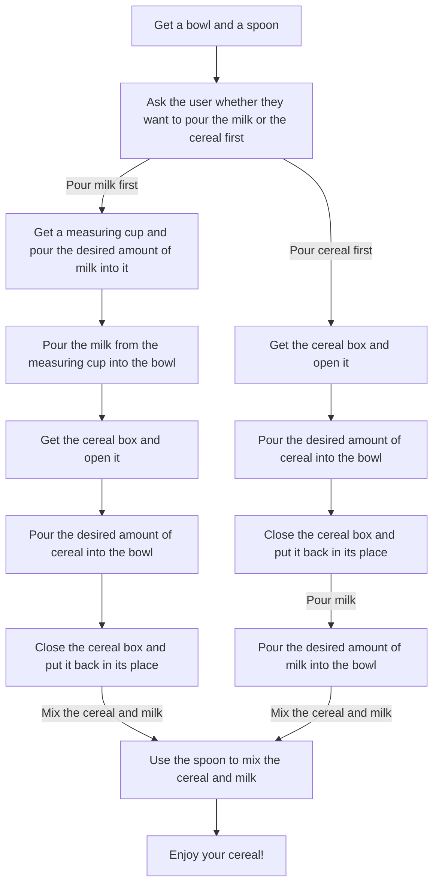

<h2>Week challenges (Monday) 💻</h2>

<h3>Logic problem 🧐</h3>

The teacher asks his 5 students if they studied mathematics yesterday.

* Alice: "Nobody studied math yesterday".
* Bob: "1 person studied math yesterday".
* Charlie: "2 people studied math yesterday".
* Dan: "3 people studied mathematics yesterday".
* Eva: "4 people studied mathematics yesterday".

The teacher knows that only those who studied would be telling the truth and those who didn't would be lying. Who is telling the truth?

1. If we assume that Alice is telling the truth, then nobody studied math yesterday. But if Alice is telling the truth, then all other statements are false, and this would mean that Bob, Charlie, Dan, and Eva are all lying. However, if Eva is lying, then her statement contradicts the statement of teacher, who also claims to be telling the truth. Therefore, it is not possible for Alice to be telling the truth.

2. If we assume that Bob is telling the truth, then only one person studied math yesterday. This means that Charlie, Dan, and Eva are lying, and Alice did not study math either. Therefore, Bob's statement is consistent with the possibility that only those who studied would be telling the truth and those who didn't would be lying.

3. If we assume that Charlie is telling the truth, then two people studied math yesterday. However, this creates a contradiction since Bob's statement of "1 person studied math yesterday" cannot be true if Charlie's statement is true.

4. If we assume that Dan is telling the truth, then three people studied math yesterday. This means that Alice, Bob, and Charlie are lying, and Eva did not study math. However, this creates a contradiction since Bob's statement of "1 person studied math yesterday" cannot be false if Dan's statement is true.

5. If we assume that Eva is telling the truth, then four people studied math yesterday. However, this creates a contradiction since Dan's statement of "3 people studied mathematics yesterday" cannot be false if Eva's statement is true.

<b>Answer: Therefore, the only statement consistent with the possibility that only those who studied would be telling the truth and those who didn't would be lying is Bob's statement. This means that only one person studied math yesterday, and Bob is the only one telling the truth in this case.</b>

 

<h3>Which comes first, cereal or milk? 🍱</h3>

1. Get a bowl and a spoon.
2. Ask the user whether they want to pour the milk or the cereal first.
3. If the user chooses to pour the milk first, go to step 4. If the user chooses to pour the cereal first, go to step 6.
4. Get a measuring cup and pour the desired amount of milk into it.
5. Pour the milk from the measuring cup into the bowl.
6. Get the cereal box and open it.
7. Pour the desired amount of cereal into the bowl.
8. Close the cereal box and put it back in its place.
9. If the user chose to pour the milk first, go to step 10. If the user chose to pour the cereal first, go to step 12.
10. Use the spoon to mix the cereal and milk.
11. Enjoy your cereal!
12. Pour the desired amount of milk into the bowl.
13. Use the spoon to mix the cereal and milk.
14. Enjoy your cereal!

